# 🎯 Awesome Candidate Sourcing Platform

  
  
  
  
  
  

  

## 🚀 Overview & Ecosystem Guide

Welcome to the **Awesome Candidate Sourcing Platform** directory! This repository is a curated catalog of notable **SaaS platforms** and **open-source projects** for **Candidate Sourcing**, **Talent Discovery**, **Resume Parsing**, **AI Candidate Matching**, and **Recruiting CRM** infrastructure.

Whether you are an enterprise recruiter searching for AI talent intelligence engines, a startup building talent acquisition workflows, or a developer engineering custom sourcing pipelines, this guide covers commercial market leaders and active open-source repositories.

---

## 📑 Table of Contents
- [💼 SaaS / Hosted Platforms](#-saas--hosted-platforms)
- [🔓 Open-Source GitHub Projects](#-open-source-github-projects)
- [🛠️ Frameworks for Building Custom Sourcing Tools](#-frameworks-for-building-custom-sourcing-tools)
- [🤝 How to Contribute](#-how-to-contribute)
- [⚠️ Disclaimer](#-disclaimer)
- [💖 Support & Sponsorship](#-support--sponsorship)
- [📈 Star History](#-star-history)

---

## 💼 SaaS / Hosted Platforms

📊 **Market Overview**: The global candidate sourcing and talent acquisition software market is estimated at **~$3.2 Billion (2026)** and is **highly fragmented** with low vendor concentration (no single platform holds >15% market share), driven by fast-paced AI adoption and niche technical sourcing requirements.

*The table below compares commercial candidate sourcing solutions, sorted by **Company Size (Revenue / Valuation)** in descending order:*

| 🏢 Platform / Tool | 💰 Company Size (Valuation / Revenue) | 🏷️ Pricing (Starting Tier) | 🎁 Free Tier / Trial Limits | ⚡ Key Sourcing Features & Focus |
| :--- | :--- | :--- | :--- | :--- |
| **[Gem](https://www.gem.com/)** | **Valuation: $1.2 Billion** (Series C, $148M raised) | **$99/user/month** (Starter tier; ACV ~$24,900/yr) | **14-day free trial** (Includes 50 profile exports & sequence templates) | Recruiting CRM, automated candidate engagement sequences, and talent pipeline analytics integrated with ATS. |
| **[SeekOut](https://seekout.com/)** | **Valuation: $1.2 Billion** (Series C, $115M raised, ~$25.2M ARR) | **$499/seat/month** (~$5,988/year per recruiter seat) | **7-day free trial** (Limited to 25 candidate profile views and searches) | Enterprise talent intelligence with 1B+ candidate profiles, diversity sourcing filters, and tech stack skill matching. |
| **[Juicebox](https://juicebox.work/)** | **Valuation: $850 Million** (Series B, $116M raised) | **$139/seat/month** (Starter; AI agents ~$400/seat/mo) | **Free Forever Tier** (Includes 10 free profile search credits per month) | Natural language candidate search engine across LinkedIn and web sources with AI sourcing agents. |
| **[Loxo](https://www.loxo.co/)** | **Funding: $115 Million** (Revenue ~$27.6M ARR) | **$169/seat/month** (Professional tier) | **Free Forever Plan** (1 seat, up to 100 candidate contacts, basic CRM/ATS) | All-in-one recruiting CRM with built-in candidate discovery, AI sourcing, and multichannel outreach automation. |
| **[Entelo](https://www.entelo.com/)** | **Funding: $40 Million** Total Raised | **$350/seat/month** (~$4,200/year seat baseline) | **14-day free trial** (15 diversity candidate profile searches & preview features) | Predictive analytics talent acquisition platform with diversity sourcing, candidate matching, and email sequences. |
| **[hireEZ](https://hireez.com/)** | **Funding: $26 Million+** (Revenue ~$20M ARR) | **$494/month** (Solo Plan; Team tier ~$13,000/yr) | **7-day free trial** (Up to 10 candidate contact detail unlocks) | Recruiting CRM and outbound sourcing platform (formerly Hiretual) with 800M+ candidate profiles and automated outreach. |
| **[Fetcher](https://fetcher.ai/)** | **Funding: $12 Million** (Series B) | **$149/seat/month** (Starter Sourcing Plan) | **14-day free trial** (10 automated candidate lead recommendations) | Automated sourcing and candidate outreach platform using AI to match and engage passive candidate leads. |
| **[SourceWhale](https://www.sourcewhale.com/)** | **Revenue: ~$11.9 Million ARR** | **$250/seat/month** ($3,000/year seat minimum) | **14-day free trial** (Up to 30 contact enrichment credits) | Multichannel candidate engagement platform automating outreach across email, LinkedIn, and phone channels. |
| **[AmazingHiring](https://amazinghiring.com/)** | **Revenue: ~$2.8 Million ARR** | **$400/seat/month** (~$4,800/year per seat) | **7-day free trial** (5 developer profile exports & folder management) | Technical recruitment search engine aggregating engineer profiles across GitHub, Stack Overflow, and social networks. |

---

## 🔓 Open-Source GitHub Projects

Open-source candidate sourcing and recruiting tools empower organizations to build custom pipelines, maintain full data privacy compliance (GDPR/CCPA), and avoid vendor lock-in.

*All open-source repositories below are sorted by **GitHub Star Count** in descending order:*

### 🥇 Top Starred Open-Source Sourcing & Resume Systems

1. **[Resume-Matcher](https://github.com/srbhr/Resume-Matcher)** 
   - **Description**: Free, open-source AI-powered resume matching and ATS optimization tool. Uses vector embeddings and LLMs to score resumes against job descriptions locally to preserve candidate privacy.
   - **Tech Stack**: Python, Streamlit, Qdrant, PyPDF2.

2. **[pyresparser](https://github.com/OmkarPathak/pyresparser)** 
   - **Description**: Python library for extracting structured information (Name, Email, Phone, Skills, Education, Experience) from resumes in PDF and DOCX formats using spaCy and NLTK.
   - **Tech Stack**: Python, spaCy, NLTK, docx2txt.

3. **[OpenCATS](https://github.com/opencats/OpenCATS)** 
   - **Description**: The standard open-source Applicant Tracking System (ATS) and recruiting CRM. Provides applicant tracking, resume management, client database, job posting management, and recruitment reporting.
   - **Tech Stack**: PHP, MySQL, Apache.

4. **[OpenPostings](https://github.com/Masterjx9/OpenPostings)** 
   - **Description**: Open-source job posting aggregator syncing job data from 110,000+ companies across 80+ ATS platforms (Greenhouse, Lever, Workday, BambooHR). Includes desktop & mobile apps.
   - **Tech Stack**: TypeScript, Node.js, Electron, Android.

5. **[talent-sourcing-toolkit](https://github.com/ohsusannamarie/talent-sourcing-toolkit)** 
   - **Description**: Curated repository of talent sourcing scripts, X-ray search strings, OSINT recruiting tools, and workflow templates for candidate discovery.
   - **Tech Stack**: Markdown, Shell, Sourcing Templates.

6. **[job-scraper](https://github.com/anandanair/job-scraper)** 
   - **Description**: Automated candidate job scraper, resume parser, and job-to-resume scoring tool executed via GitHub Actions. Uses Supabase for storage and LiteLLM for AI scoring.
   - **Tech Stack**: Python, GitHub Actions, Supabase, LiteLLM.

7. **[OpenJobs AI / People Skills](https://github.com/OpenJobsAI/openjobs-openclaw-skills)** 
   - **Description**: OpenClaw skills suite for candidate discovery, people search, skill taxonomy matching, and academic scholar sourcing for AI recruiting agents.
   - **Tech Stack**: Python, OpenClaw Agent SDK.

8. **[JobHuntTS](https://github.com/BaseMax/JobHuntTS)** 
   - **Description**: Open-source job board platform and candidate application API built with GraphQL. Supports job search, bookmarks, application tracking, and candidate submissions.
   - **Tech Stack**: Express.js, GraphQL, JavaScript.

9. **[HR-OS](https://github.com/rathishreya/HR-OS)** 
   - **Description**: AI-native hiring operating system featuring candidate resume ingestion, local vector embeddings, explainable weighted AI scoring, screening chat interview agent, and an MCP server with 10 hiring tools.
   - **Tech Stack**: FastAPI, React 19, Vite, Tailwind v4, Claude/Ollama.

10. **[JobLeet](https://github.com/nixhantb/jobleet-ui)** 
    - **Description**: Modern candidate CRM and ATS connecting candidates, recruiters, and companies with real-time notifications, talent pool management, and interview scheduling.
    - **Tech Stack**: Next.js 15, TypeScript, Tailwind CSS.

11. **[ResumeParser](https://github.com/HarithaNetha8/ResumeParser)** 
    - **Description**: Lightweight Flask REST API for parsing candidate resumes (PDF, DOCX, TXT) into structured JSON containing contact details and extracted skills.
    - **Tech Stack**: Python, Flask, PyMuPDF, python-docx.

12. **[candidate-scorer](https://github.com/soldera-org/candidate-scorer)** 
    - **Description**: Chrome extension and Python candidate scoring workflow. Captures LinkedIn applicant profiles and scores candidates against job specs and culture fit using Claude AI API.
    - **Tech Stack**: JavaScript (Chrome Extension), Python, Claude API.

13. **[LinkedIn Recruiter Assistant](https://github.com/junqing258/linkedin-job-assistant)** 
    - **Description**: Chrome extension for LinkedIn search optimization. Translates natural language hiring criteria into precise Boolean search queries and performs semantic candidate ranking.
    - **Tech Stack**: React 18, TypeScript, OpenAI GPT-4 API.

14. **[TalentLedger](https://github.com/C4rcer/talent-ledger)** 
    - **Description**: Browser extension for local candidate tracking. One-click LinkedIn candidate logging, Kanban outreach pipeline management, local-first storage, and export to Greenhouse/Workable CSV.
    - **Tech Stack**: JavaScript, Browser Extension API.

---

## 🛠️ Frameworks for Building Custom Sourcing Tools

To construct an end-to-end self-hosted recruiting stack:
- 🏗️ **ATS & Candidate Management Core**: Deploy **OpenCATS** or **JobLeet** for candidate pipeline state, applicant tracking, and recruiter activity.
- 📄 **Resume Parsing & Vector Search**: Combine **Resume-Matcher** or **pyresparser** to transform unstructured PDF/Word resumes into JSON data and vector embeddings.
- 🧠 **AI Scoring & Screening Agent**: Integrate **HR-OS** or **candidate-scorer** for automated candidate relevance scoring against job requirements.
- 📡 **Job Data & Sourcing Sync**: Use **OpenPostings** or **job-scraper** for multi-board job syndication and candidate profile scraping.

---

## 🤝 How to Contribute

Contributions are welcome! To contribute:
1. Fork this repository.
2. Add your candidate sourcing tool, open-source project, or parser in the relevant section.
3. Include tool name, URL, exact pricing / star badge, and factual 1-2 sentence description.
4. Submit a Pull Request with a short summary of changes.

---

## ⚠️ Disclaimer

This list is curated for informational and educational purposes. Candidate sourcing platforms and resume parsing engines process sensitive personal data. Ensure all deployment configurations comply with applicable data protection legislation including GDPR, CCPA, and regional talent acquisition regulations.

---

## 💖 Support & Sponsorship

If you find this candidate sourcing directory helpful, please consider supporting the project!

- ⭐ **Star** this repository on GitHub.
- 🔀 **Fork** and share it with your recruiting and engineering networks.
- ☕ **Buy Me a Coffee / Sponsor**: Support ongoing maintenance via the [GitHub Sponsors Dashboard](https://github.com/sponsors/ishandutta2007).

  

---

## 📈 Star History

